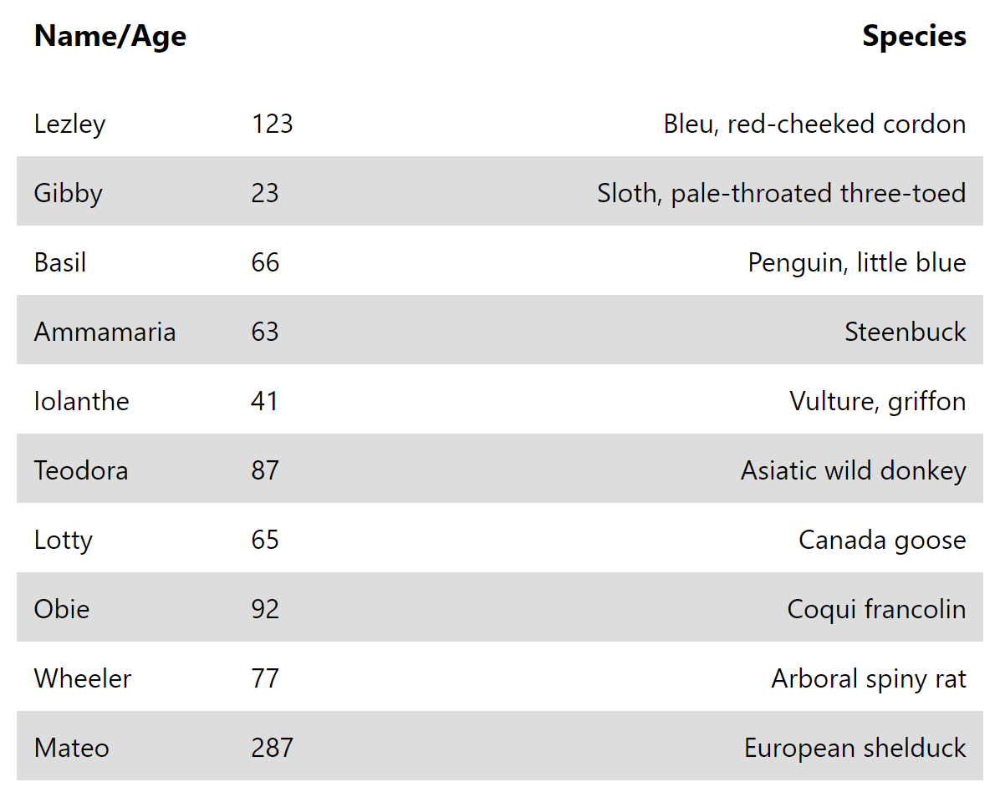
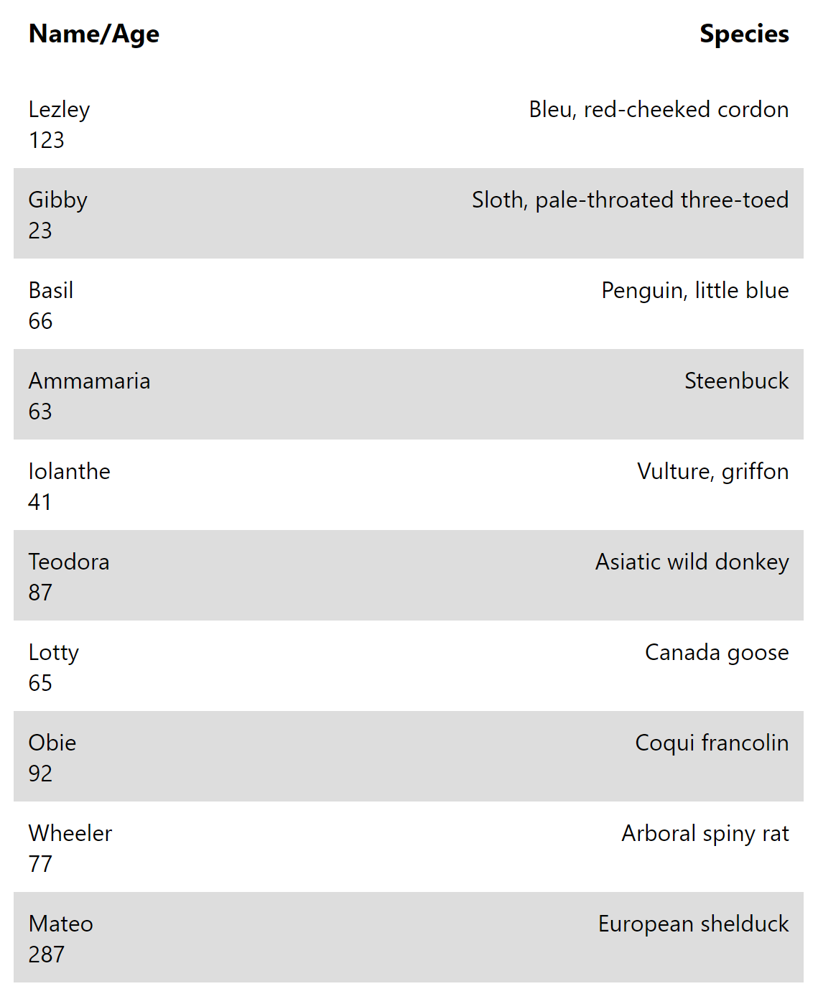

# **Mountain America Coding Challenge**
Clone this repo (or download zip) and complete Parts 1 & 2. When you're finished, push your changes up to a public repo we can view or send it to us in a zipped file.

---

## **Part 1**
Complete the Express API and React App to display a list of animals. Please use hooks instead of component lifecycle methods.

Some placeholder animal data is provided in /server/data.js. (`const data = require('./data');`)

#### **Requirements**:
* Style the background of every other row
* At screen widths 600px and greater: the name and age should be adjacent. At screen widths less than 600px: the name and age should be stacked vertically
* Example list design:
    *  

#### **Extra credit**:
* Style the list further
* Add a text search filter to the list
* Add create, update, and delete functionality

---
### Install the **server** (generated using [express-generator](https://expressjs.com/en/starter/generator.html))

    > cd server
    > npm install

### Run the **server** ([http://localhost:3030](http://localhost:3030))

    > npm start

---

### Install the **client** (generated using [Create React App](https://github.com/facebook/create-react-app))

    > cd client
    > npm install

### Run the **client** ([http://localhost:3000](http://localhost:3000))

    > npm start

---
## **Part 2**

In `toy-problems/index.js` please complete the first function (`isPrime`) and be ready to write and discuss some of the remaining functions during the interview.

### Install dependencies

    > cd toy-problems
    > npm install

### Test your code

    > npm run test